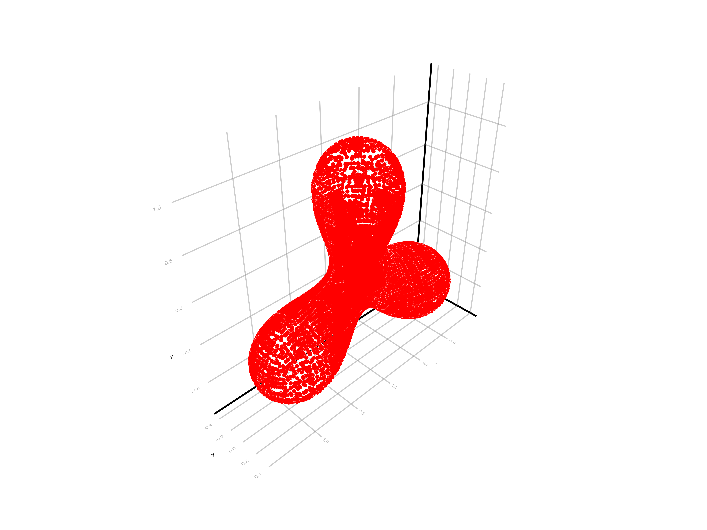

# ImplicitIntegration

[](https://maltezfaria.github.io/ImplicitIntegration.jl/stable/)
[](https://maltezfaria.github.io/ImplicitIntegration.jl/dev/)
[](https://github.com/maltezfaria/ImplicitIntegration.jl/actions/workflows/CI.yml?query=branch%3Amain)
[](https://codecov.io/gh/maltezfaria/ImplicitIntegration.jl)
[](https://github.com/JuliaTesting/Aqua.jl)

**ImplicitIntegration** is a *Julia* library for approximating volume and surface integrals
over implicitly defined domains in arbitrary dimensions. It implements the algorithm
described in

> Saye, R. I. (2015). High-order quadrature methods for implicitly defined surfaces and
> volumes in hyperrectangles. SIAM Journal on Scientific Computing, 37(2), A993-A1019.

Key features include:

- Implicit volume and surface integrals in arbitrary dimensions
- Flexible domain definition through native Julia functions
- High-precision integration
- Customizable interface

## Quick Start

To install:

```julia
using Pkg
Pkg.add("ImplicitIntegration")
```

Here is how to compute the area of a unit disk in 2D:

```julia
using ImplicitIntegration
ϕ = (x) -> sqrt(x[1]^2 + x[2]^2) - 1 # level-set function
f = (x) -> 1                         # integrand
result = integrate(f, ϕ, (-1.5, -1.5), (1.5, 1.5))
result.val ≈ π # true
```

To compute the perimeter, simply set `surface = true`:

```julia
result = integrate(f, ϕ, (-1.5, -1.5), (1.5, 1.5); surface = true)
result.val ≈ 2π # true
```

More interesting surfaces can be obtained by changing `ϕ`. Here is an example of a
quadrature for a three-dimensional [Cassini
oval](https://en.wikipedia.org/wiki/Cassini_oval):

```julia
using ImplicitIntegration, StaticArrays, GLMakie, LinearAlgebra
p1, p2, p3 = SVector(-1.0, 0, -√3 / 2), SVector(1.0, 0, -√3 / 2), SVector(0, 0, √3 / 2)
b = 1.5
# surface s.t. product of distances to p1, p2, p3 is constant
ϕ = x -> (x - p1) ⋅ (x - p1) * (x - p2) ⋅ (x - p2) * (x - p3) ⋅ (x - p3) - b^2 
out = quadgen(ϕ, (-2, -2, -2), (2, 2, 2); order = 1, surface = true)
scatter(out.quad.coords; markersize = 5, color = :red)
```



For detailed usage, examples, and advanced options, please refer to the [official
documentation](https://maltezfaria.github.io/ImplicitIntegration.jl/dev/).
